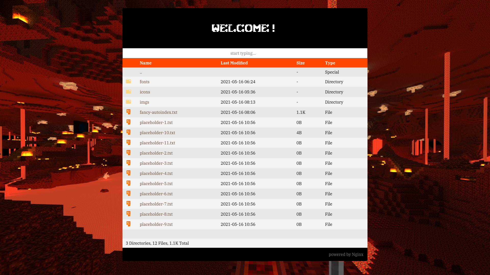

# nginx-pretty-index

> XSLT styles for Nginx AutoIndex Pages



## Installation

- install `nginx`
- install [`ngx_http_xslt_module`](https://nginx.org/en/docs/http/ngx_http_xslt_module.html).
  on Ubuntu, it's named as `nginx-module-xslt`
- load modules in `nginx.conf`
  ```
  load_module modules/ngx_http_xslt_filter_module.so;
  ```
- download [styles.xslt](./styles.xslt)
- modify server blocks as required. here's a snippet for your reference

  ```conf
  server {
    ......
    ......

    location / {
      try_files $uri @autoindex;
    }

    location @autoindex {
      autoindex on;
      autoindex_exact_size off;
      autoindex_format xml;

      xslt_string_param path $uri;
      xslt_stylesheet path/to/styles.xslt;
    }

    ......
    ......

  }
  ```

- check nginx syntax (`sudo nginx -t`) and restart nginx process

## Features

1.  **Beautiful Colors** (borrowed from [Keith Knittel - CSSTricks](https://css-tricks.com/styling-a-server-generated-file-directory/))
2.  **Responsive Page** - Mobile users can browse through files easily
3.  **Filter** files by name
4.  **Icons** - File and Folder icons


## Credits

This work is based upon [dirlist.xslt](https://gist.github.com/wilhelmy/5a59b8eea26974a468c9) 
by [Moritz Wilhelmy](https://github.com/wilhelmy)
